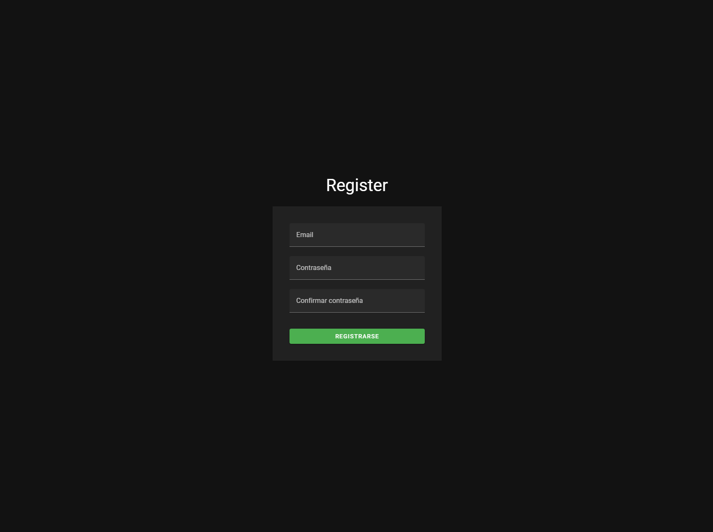

# RETO TÉCNICO INTERSEGURO - FRONTEND

Este proyecto es un desafío técnico que integra un sistema de autenticación básico, protegido mediante JWT y desarrollado en Vue 3. Además, proporciona una interfaz intuitiva accesible tras el inicio de sesión, permitiendo la creación dinámica de matrices, la verificación de si una matriz es diagonal y el cálculo de su factorización QR.

## Stack tecnológico

**Server:** Vue3, Vuetify3, Vite, Typescript, Docker, Pinia 


## Ejecución

Para ejecutar el proyecto, utiliza el siguiente comando:

```bash
  docker-compose up --build
```


## Variables de entorno

Para ejecutar este proyecto, necesitas agregar las siguientes variables de entorno a tu archivo .env:

`VITE_BASE_URL`

## Vista de inicio de sesión


## Vista de registro



## Vista principal


## Vista con resultados


